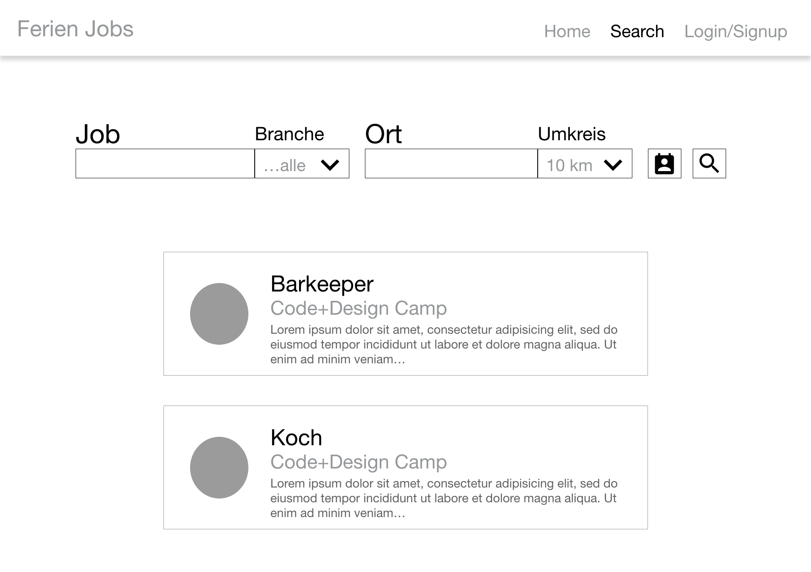

# FerienJobsBörse
Diese Website einer FerienJobsBörse entsteht im Rahmen des Code + Design Camp Köln 2017

## Requirements

- `python3`
- `pip3`
- `django`
- (`mysql`)
- `mysql-server` (brew)
- `mysql-client` (pip3)

## Install Instructions

- clone project `git clone $url`
- `cd django`
- `python manage.py runserver`
- visit the url that was printed in the console

## Mockups

